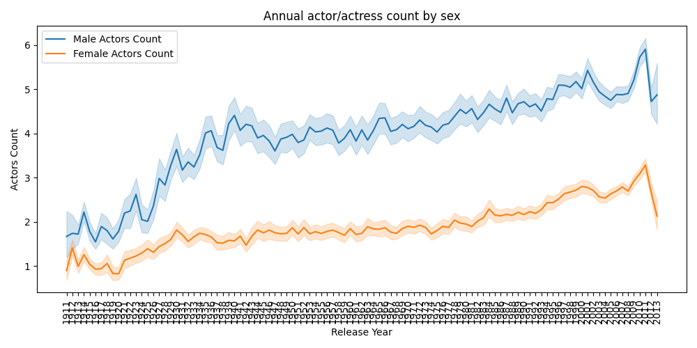
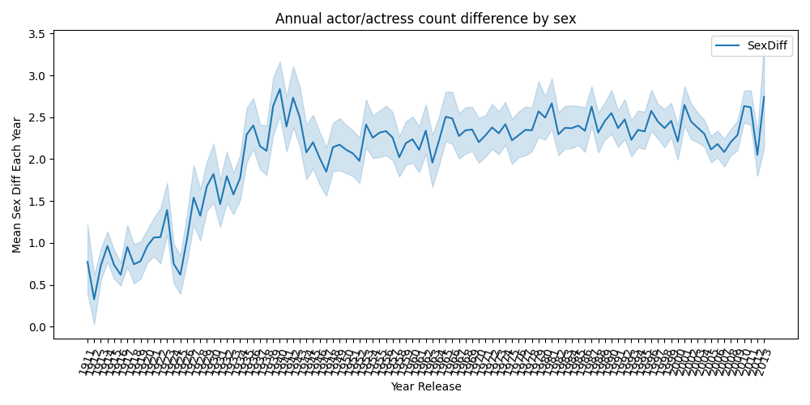
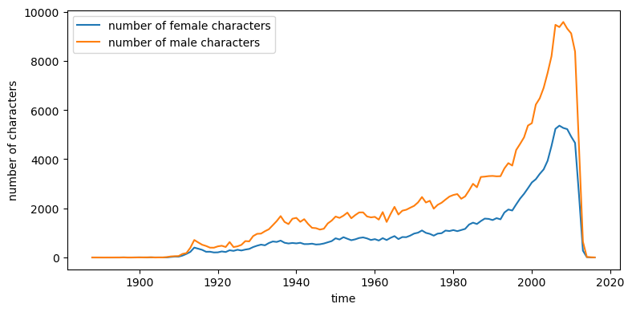
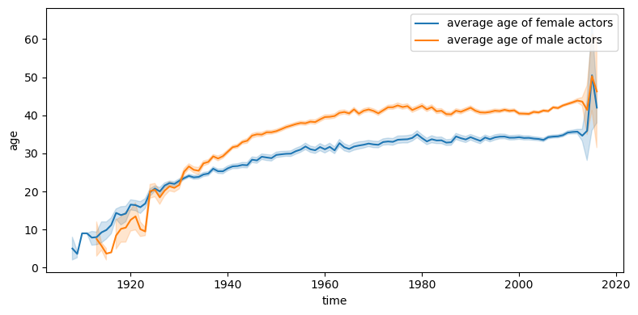

# Gender Analysis on CMU Movie Dataset

_**A**ll**d**atapoint**a**ccurate: Yiyang Feng, Naisong Zhou, Haotian Wu, Haolong Li_

## Abstract

As feminist consciousness grows, gender differences have received much more attention, and people have started to wonder where gender differences occur. Movies are a significant player in people's lives. Thus we would like to examine whether gender differences exist in movies. We divide gender differences into gender stereotypes and gender inequalities and analyze their existence and effect over time. We will first see whether gender stereotypes exist in movie plot summaries as their influence on movies themselves and figure out how they evolve. Then we will tap into the evolutions of gender inequalities from overall gender composition, the social network of actors, and actor careers. After this study, we can gain a deeper understanding of gender differences in films.

## Research Questions

- Do gender stereotypes exist in movie plot summaries and how can we visualize them?
- How does the gender composition among the actors change over time?
- How does gender affect actors' careers in their opportunities and success?
- Is there a structural gender difference in the social networks of actors?

## Proposed Additional Datasets

- [Processed summaries with Stanford CoreNLP pipeline](http://www.cs.cmu.edu/~ark/personas/data/corenlp_plot_summaries.tar): The CMU Movie Summary Corpus dataset that have been run through the Stanford CoreNLP pipeline. These summaries are stored in XML format. This dataset can be used to extract character descriptors as defined in the paper [Learning Latent Personas of Film Characters](http://www.cs.cmu.edu/~dbamman/pubs/pdf/bamman+oconnor+smith.acl13.pdf) by David Bamman, Brendan O'Connor, and Noah A. Smith. We use the word POS for our analysis.

## Methods

> ### Do gender stereotypes exist in movie plot summaries and how can we visualize them?

We defined gender stereotypes as the presence of gender-neutral words biased towards describing male or female characters. We consider relevant words for characters as the first or last two words of a verb or adjective from the character name within sentences in plot summaries. We extract relevant words around these names by gender and count the log frequency of words related to different genders.

For qualitative analysis, we look at the differences in frequencies of words between genders and rank the verbs and adjectives based on this difference. as the most-distinguishable words for men and women.


We can find that men and women have more distinct word preferences. For the verbs and adjectives, males are associated with crime (kill, shoot, fight, arrest, dead, criminal.), power (lead, manage, powerful), and politics (corrupt), while females are depicted with the word marriage (marry, marriage), love, reproduction (pregnant), appearance (beautiful) and sex (seduce, sexual).

For quantitative analysis, we compare the distributions of verb or adjectives frequencies between men and women. We use a chi-square test to see if the difference is significant and adopt KL divergence to measure how different the two distributions are. The p-value in the chi-square test is close to zero, indicating the difference is significant. The KL divergence is 0.07 and 0.16 for verbs and adjectives.

Then we wonder if the gender stereotype evolves with time. We will still use qualitative and quantitative analysis. We group the movies by the release date and cut them by decades.


We only show the verbs here. The results of adjectives are similar. We can find that the trends are similar and coherent with the overall analysis. However, we notice a decrease in absolute value by looking at the scale of the x-axis. This may tell us that the bias exists, but it is decreasing with time. Our quantitative analysis further argues this point. We do a regression analysis between KL divergence and decades.


We could see that the KL divergence is decreasing, so gender stereotype exists but decreases with time. We also compare the gender stereotypes between genres, but that's not part of our main story and you can see the notebook for details.

> ### How does the gender composition among the actors change over time?

In this section, we are interested in how gender composition in the movie industry evolves. To answer these questions, we first derive the annual gender composition in the movie industry.



With the annual actors count by sex in hand, we are able to investigate into the gender composition in the movie industry by time.

First, we look at the difference of counts across genders by year.



Then, we look at the ratio of male actors count against the female actresses count by year.


It is not hard to see that the __portion__ of female actors first decreases then increases, while the absolute number of female actors keeps increasing after around 1942.

We explain that:

$$\frac{Male}{Female} = f(t)$$

Therefore we have:

$$Male - Female = Female(f(t) - 1)$$

We observe that:
- $Male - Female = Female(f(t) - 1)$ increases to summit at 1941, then decreases and stays stable.
- $\frac{Male}{Female} = f(t)$  increases to summit at 1941, then decreases all the way.

We conclude that the ratio of male-female attendance in films first increases then decreases. But genreally there are more men than women in the movie industry.

To count for the stable variation of actors count difference, we explain that it is because the increase of absolute number of women actress.

> ### How does gender affect actors' careers in their opportunities and success?

We raised two sub-questions when investigating how female and male actors differ in their careers: Are female and male actors given equal opportunities in the movie industry? Do they achieve the same level of success?

To answer the first question, we grouped characters by year and see if the total number of female and male actors differs:



We also plot the average age evolution of female and male actors:



The plots above show that: 1. female characters are far fewer than male actors, and the opportunities are not equally given. 2. female actors are generally younger than male actors, meaning that female actors have a shorter career span than male actors. What leads to this phenomenon? We will investigate through 4 main directions: market preference, the social influence of actors, stereotypes in movies, and the general lack of opportunities for women in all professions.

To answer the second question, we need first to define success. We will define a function that aggregates both revenues actors made and their industrial influence based on the following discussed social network, which is to be implemented and refined afterwards.

> ### Is there a structural gender difference in the social networks of actors?

Actors are an essential part of the movies, and the movies in which the two actors have worked together can be seen as a direct link between these two actors, which contributes to a vast social network. With the help of such a network structure, we can find the structural gender difference in the movies.

We start to build up the graph with the prepared nodes and edges data. We use `nx.Graph()` to generate an empty undirected graph and load our prepared data. In our social network graph, every actor represents a node and has an edge between two nodes if the two actors cooperate in at least one movie. First, we analyze the Top100 most influential actors' gender and height difference preliminarily and then draw out their social relationship topology. In the next stage, we will consider the attributes of edges in our graph, such as the number of cooperation. We also try to use the Louvain Modularity Algorithm or Girvan-Newman Algorithm to analyze gender differences in the social relationship topology.


## Environment Setup

Run in the terminal:

```shell
conda env create -f environment.yml
```

## Proposed Timeline

- 18 November – 25 November: Continue the project and conduct a deeper analysis according to the future directions.
- 25 November – 2 December: Pause project work and do the Homework 2.
- 2 December –9 December: Integrate all analysis and write out the draft of our datastory.
- 9 December – 16 December: Complete the team GitHub including all code and other documents, and revise our datastory to the final version.
- 16 December – 23 December: Build the web development interface to tell our datastory.

## Organization within the Team

<!---
A list of internal milestones up until project Milestone 3.
--->
<table class="tg" style="undefined;table-layout: fixed; width: 342px">
<colgroup>
<col style="width: 164px">
<col style="width: 178px">
</colgroup>
<thead>
  <tr>
    <th class="tg-0lax"></th>
    <th class="tg-0lax">Tasks</th>
  </tr>
</thead>
<tbody>
  <tr>
    <td class="tg-0lax">Haolong</td>
    <td class="tg-0lax">Discover regional gender composition in the movie industry<br><br>Discover the relationship between gender composition and factors like major social events or societal wealth<br><br>Develop the final text for the data story</td>
  </tr>
  <tr>
    <td class="tg-0lax">Haotian</td>
    <td class="tg-0lax">Build the actor social network to analyze the structural gender difference in the actor relationship<br><br>Develop the web interface for the data story<br><br>Develop the final text for the data story</td>
  </tr>
  <tr>
    <td class="tg-0lax">Naisong</td>
    <td class="tg-0lax">Analyze difference f/m career opportunities through character persona clustering and social analysis<br><br>Discover the relationship between gender and actors' level of success<br><br>Develop the final text for the data story</td>
  </tr>
  <tr>
    <td class="tg-0lax">Yiyang</td>
    <td class="tg-0lax">Develop the web interface<br><br>Process text data from plot summaries<br><br>Analyze gender stereotypes from processed text data<br><br>Develop the final text for the data story</td>
  </tr>
</tbody>
</table>
