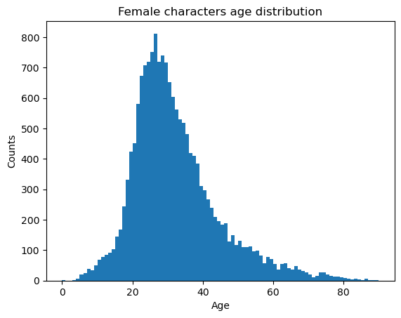
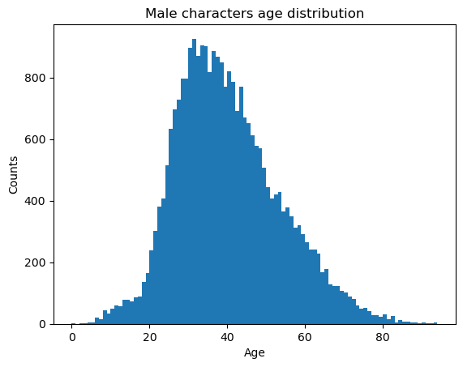
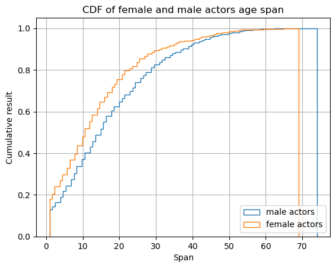
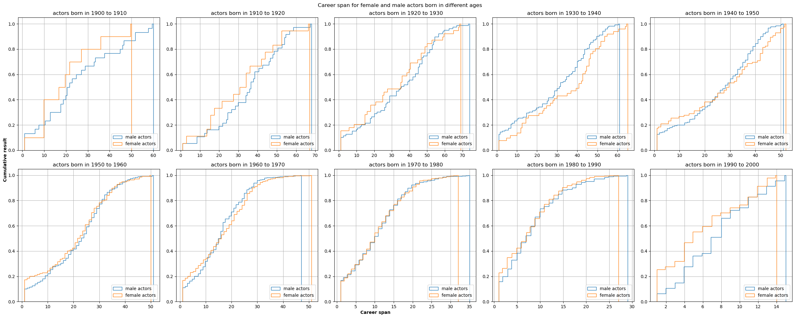
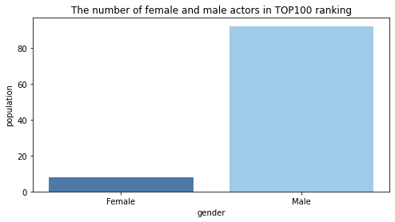
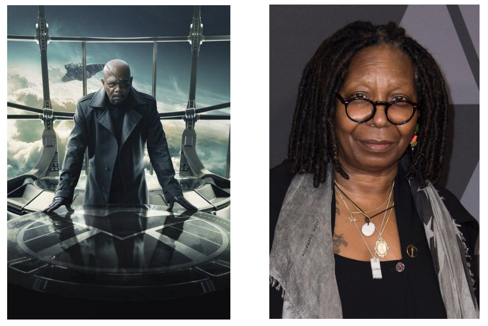
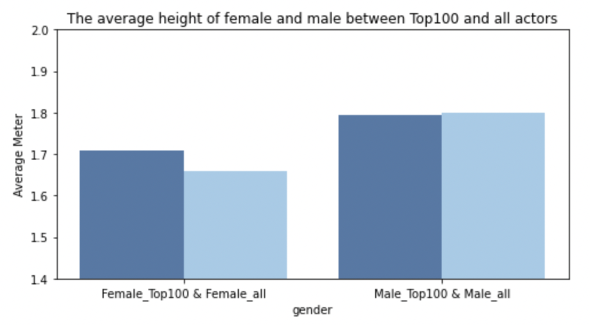
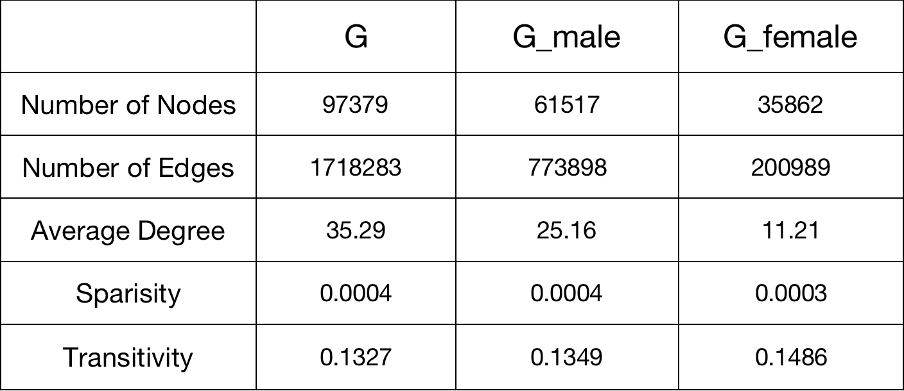

# Gender Analysis on CMU Movie Dataset

_**A**ll**d**atapoint**a**ccurate: Yiyang Feng, Naisong Zhou, Haotian Wu, Haolong Li_

Here is our [data story](https://zns2019.github.io/ADA-datastory/).

## Abstract

As feminist consciousness grows, gender differences have received much more attention, and people have started to wonder where gender differences occur. Movies are a significant player in people's lives. Thus we would like to examine whether gender differences exist in movies. First, we claim the existence of gender difference by investigating the graphical structure of actors collaboration and by pointing out the uneven distribution of actor ages upon participation and the distribution of actor's career span. We then observe from movie plot summaries by looking at most frequency-diverged words across two genders; After that, we tap into the evolutions of gender inequalities by investigating the gender composition in the movie industry over time; Finally, we focus on how the distribution of actors' career age span change over decades to count for the varying gender inequalities.

## Research Questions

- Do gender stereotypes exist in movie plot summaries and how can we visualize them?
- How does the gender composition among the actors change over time?
- How does gender affect actors' careers in their opportunities and success?
- Is there a structural gender difference in the social networks of actors?

## Proposed Additional Datasets

- [Processed summaries with Stanford CoreNLP pipeline](http://www.cs.cmu.edu/~ark/personas/data/corenlp_plot_summaries.tar): The CMU Movie Summary Corpus dataset that have been run through the Stanford CoreNLP pipeline. These summaries are stored in XML format. This dataset can be used to extract character descriptors as defined in the paper [Learning Latent Personas of Film Characters](http://www.cs.cmu.edu/~dbamman/pubs/pdf/bamman+oconnor+smith.acl13.pdf) by David Bamman, Brendan O'Connor, and Noah A. Smith. We use the word POS for our analysis.

## Methods

> ### Do gender stereotypes exist in movie plot summaries and how can we visualize them?

We defined gender stereotypes as the presence of gender-neutral words biased towards describing male or female characters. We consider relevant words for characters as the first or last two words of a verb or adjective from the character name within sentences in plot summaries. We extract relevant words around these names by gender and count the log frequency of words related to different genders.

For qualitative analysis, we look at the differences in frequencies of words between genders and rank the verbs and adjectives based on this difference. as the most-distinguishable words for men and women.


We can find that men and women have more distinct word preferences. For the verbs and adjectives, males are associated with crime (kill, shoot, fight, arrest, dead, criminal.), power (lead, manage, powerful), and politics (corrupt), while females are depicted with the word marriage (marry, marriage), love, reproduction (pregnant), appearance (beautiful) and sex (seduce, sexual).

For quantitative analysis, we compare the distributions of verb or adjectives frequencies between men and women. We use a chi-square test to see if the difference is significant and adopt KL divergence to measure how different the two distributions are. The p-value in the chi-square test is close to zero, indicating the difference is significant. The KL divergence is 0.07 and 0.16 for verbs and adjectives.

Then we wonder if the gender stereotype evolves with time. We will still use qualitative and quantitative analysis. We group the movies by the release date and cut them by decades.


We only show the verbs here. The results of adjectives are similar. We can find that the trends are similar and coherent with the overall analysis. However, we notice a decrease in absolute value by looking at the scale of the x-axis. This may tell us that the bias exists, but it is decreasing with time. Our quantitative analysis further argues this point. We do a regression analysis between KL divergence and decades.


We could see that the KL divergence is decreasing, so gender stereotype exists but decreases with time. We also compare the gender stereotypes between genres, but that's not part of our main story and you can see the notebook for details.

> ### How does the gender composition among the actors change over time?

In this section, we are interested in how gender composition in the movie industry evolves. To answer these questions, we first derive the annual gender composition in the movie industry.


With the annual actors count by sex in hand, we are able to investigate into the gender composition in the movie industry by time.

First, we look at the difference of counts across genders by year.


Then, we look at the ratio of male actors count against the female actresses count by year.


It is not hard to see that the __portion__ of female actors first decreases then increases, while the absolute number of female actors keeps increasing after around 1942.

We explain that:

$$\frac{Male}{Female} = f(t)$$

Therefore we have:

$$Male - Female = Female(f(t) - 1)$$

We observe that:
- $Male - Female = Female(f(t) - 1)$ increases to summit at 1941, then decreases and stays stable.
- $\frac{Male}{Female} = f(t)$  increases to summit at 1941, then decreases all the way.

We conclude that the ratio of male-female attendance in films first increases then decreases. But genreally there are more men than women in the movie industry.

To count for the stable variation of actors count difference, we explain that it is because the increase of absolute number of women actress.

> ### How does gender affect actors' careers?

In this part, we investigate how female and male actors differ in their careers. From the population of female/male characters, we can see a difference in their opportunities. From charater age distribution and career span of actors, we see a generally shorter career span of female actors than male actors.

We grouped female/male characters by year and draw a line plot as comparison. It is similar with in previous section but in total population, which shows a general lack of opportunities for female actors than male actors.(The twist plot near 2020 is probably due to some abnormal data.)


We also plot the average age evolution of female and male actors. It is interesting to see the average ages of both female and male actors increase over time, while in general female actors are almost always youger than male actors.(Again the twist plot near 2020 is probably due to some abnormal data.)


The peak of character ages are in about 20s to 30s for both female and male, while also slight difference exists. The peak of male characters comes a bit later than female characters.





Besides the peak shift, we see the hist of female age distribution "thinner" than that of male age distribution, which probably means shorter career span. To be more precise, we sort the data with actors with their charaters. The career span in year is then computed from the difference of latest and ealiest character. 

Below are the figures of general career span distribution and its evolution through different years. From these we could conclude that female actors generally have shorter career span than male actors, while most actors only have 1 year of career span, meaning only have starred in 1 movie. From the plots for actors born in different ages, we see the difference between genders is narrowing. (Except for the last plot for actors born from 1990 to 2000, but those may be too young to say about a entire career span.) It may be because of increasing awareness of female rights. 




We also tried to find out the reason behind the population difference, which could be seen in `milestone_p3.ipynb` for detail.
> ### Is there a structural gender difference in the social networks of actors?

Actors are an essential part of the movies, and the movies in which the two actors have worked together can be seen as the connect between these two actors, which contributes to a very big social network. With the help of such a network structure, we can find out the structural gender difference in the movies.

We start to build up the graph with the prepared nodes and edges data. We use `nx.Graph()` to generate an empty undirected graph and load our prepared data. In our social network graph, every actor represents a node and there is a edge between two nodes if the two actors have cooperated at least one movies. **The more degrees the node has, the more influential the actor is**.

First we select the top 100 nodes which have the most degrees, which means that they represent 100 most influential actors. We name the original graph G and this subgraph G100. After obversing the gender distribution in graph G and G100, we can find that there are only eight females in the Top100 actors, which shows that in social network of actors the male actors occupy the absolute main force.



We also have a look at the most famous male and female actors, who are Samuel L. Jackson and Whoopi Goldberg.



After filtering some height outliers, we analyse the height difference in G and G100 between male and female actors. The p-value of T-test for the average height of male between Top100 and all actors is **0.61**, which shows that they are different in fact. So we can find that for female actors, who are in Top100 are usualy taller, but for male actors, who are in Top100 almost the same as the average or even shorter than average. It is a fact that taller people are more likely to become an actor or appear in the movies. Furtherly we can make a conclusion that Society has broad height requirements for male actors, but it often has higher requirements for women.



Finally, we generate male subgraph G_male and female subgraph G_female from the social netowrk graph G and compute structural features on them to explore the structural gender difference. 



It is interesting that although male actors's nodes have more average degrees in male subgraph, which means that there are more cooperations in the film and television industry between male actors, female actors actually have more stable partnerships with female actors accroding to the higher transitivity value of gender subgraphs and higher clustering coefficient of specific actors

One convincing explanation is that the number of female actors is less than the male actors, so for every specific kind of female character group in the movies, there are few potiental female candidates, and that is why there is more stable cooperation relationship between female actors.

## Environment Setup

Run in the terminal:

```shell
conda env create -f environment.yml
```

## Proposed Timeline

- 18 November – 25 November: Continue the project and conduct a deeper analysis according to the future directions.
- 25 November – 2 December: Pause project work and do the Homework 2.
- 2 December –9 December: Integrate all analysis and write out the draft of our datastory.
- 9 December – 16 December: Complete the team GitHub including all code and other documents, and revise our datastory to the final version.
- 16 December – 23 December: Build the web development interface to tell our datastory.

## Organization within the Team

<!---
A list of internal milestones up until project Milestone 3.
--->
<table class="tg" style="undefined;table-layout: fixed; width: 342px">
<colgroup>
<col style="width: 164px">
<col style="width: 178px">
</colgroup>
<thead>
  <tr>
    <th class="tg-0lax"></th>
    <th class="tg-0lax">Tasks</th>
  </tr>
</thead>
<tbody>
  <tr>
    <td class="tg-0lax">Haolong</td>
    <td class="tg-0lax">Analysis on gender composition<br><br>Develop the web interface for the data story<br><br>Building the final datastory website & Integrating results<br><br>Developing the final text for the data story</td>
  </tr>
  <tr>
    <td class="tg-0lax">Haotian</td>
    <td class="tg-0lax">Build the actor social network to analyze the structural gender difference in the actor relationship<br><br>Develop the web interface for the data story<br><br>Develop the final text for the data story</td>
  </tr>
  <tr>
    <td class="tg-0lax">Naisong</td>
    <td class="tg-0lax">Analyze difference f/m career opportunities through character persona clustering and social analysis<br><br>Discover the relationship between gender and actors' level of success<br><br>Develop the final text for the data story</td>
  </tr>
  <tr>
    <td class="tg-0lax">Yiyang</td>
    <td class="tg-0lax">Develop the web interface<br><br>Process text data from plot summaries<br><br>Analyze gender stereotypes from processed text data<br><br>Develop the final text for the data story</td>
  </tr>
</tbody>
</table>
